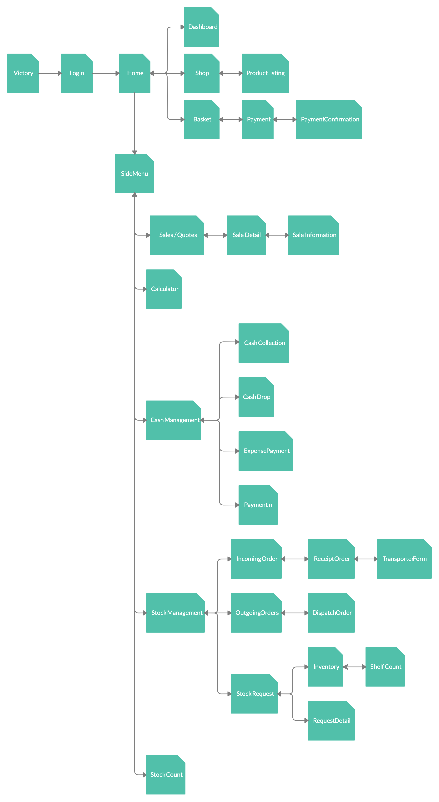
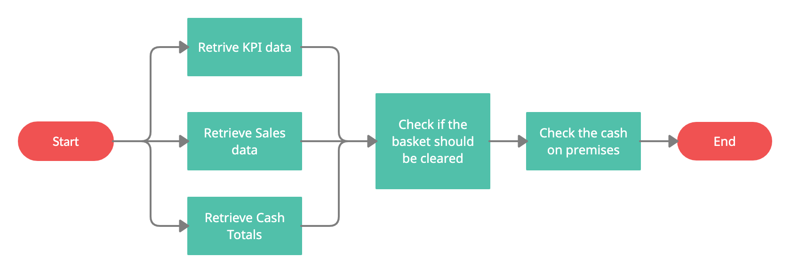

<!-- 

  

 -->
<!--  -->

# Documentation for the Mobile App
## Table of Contents
1. [Overview](#overview)
2. [The current solution](#the-current-mPos-Application)
3. [The new solution](#the-new-mPos-Application)
4. [Sitemap](#sitemap)
5. [Page Breakdown](#page-breakdown)  
  5.1. [Login](#login)  
  5.2. [Dashboard](#dashboard)
6. [Disclaimer](#disclaimer)
7. [Resources](#resources)

 

# Overview

Victory Mobile Point-of-Sale solution created whilst working at [Vectra][web_1].  
Author: [Euan Scott][web_2]

The idea behind the project was to take the original version created in Ionic 3 and to update it to not only use the latest version of Ionic with Capacitor, but also to update & improve the code base as a whole. Creating a new coding standard that will make the project easier to work on and easier to learn as new developers join the team.

## Overall goals of the project:
- Implement the Mobile App using the latest mobile technologies.
- Refactor the code to be simpler and more streamlined.
- Streamline the business rules.

### What I will be doing:
  - Implementing a coding standard that is easy to follow and easy to understand.
  - Refactor the existing code base to not be as convoluted.
  - Implement better practices taking into account the best standards for developing mobile apps.
  - Tweaking the UI/UX to accommodate the the new framework version

### What I won't be doing:
- Reinventing the wheel.
- Overhauling the UI/UX.
- Re-implementing all the existing business logic.

 

The motivation behind the update of the Mobile app outside of normal business hours is 2 fold. Firstly, it is a great way to learn and upskill myself in the latest version of the Ionic Framework. Secondly, at some point the system will not be as maintainable using older technologies so it will need to be updated. This way I can get a bit head start.

To quote _Mahatma Gandhi_ <small>(even though it is a fanciful quotation)</small>:

> Be the change you wish to see in the world.

 

# Sitemap

  

 

# Page breakdown
## Login
__Process Flow:__

  

 

__Description:__ The login page allows users to gain access to the mPos system via online or offline login.

__Background Processes:__ 
- If the user logged in while online:
  - The Branch & User Info is retrieved and saved in local memory to be used throughout the app. The storage data is also updated for use in offline login.
  - The Branch config file as saved on the Victory Portal is retrieved and saved in local memory. THe storage data is also updated for use in offline login.
  - The products in local memory are updated, as well as storage for use when offline.
  - The controller IP linked to the branch is updated in storage.
- If the user logged in while offline:
  - The Branch & User info is retrieved from storage and saved in local memory.
  - The Branch config file is retrieved from storage and saved in local memory.
  - The current products in storage as retrieved and saved in local memory to be used.
  - __Note:__ _the data is out of date, but it still allows a user to do basic functionality on the app. Namely sales_

__Business Rules:__
- Anyone with access to the Victory system can login to the Mobile app.
- If a user choses to reset their pin, an SMS is sent to their registered phone number with a new pin for them to use.

 

---

## Dashboard

__Process Flow:__

  

__Description:__ The Dashboard Page displays an overview of the logged in Branch and allows navigation to the rest of the Mobile App.

__Background Processes:__
<!-- - The KPI data is retrieved that displays the sales for the day/week/month and the total transactions made for the day.
- The sales trends for the last 7 days/weeks/months are retrieved and displayed on the page.
- The total Cash in Till/Cash in Safe and Cash on Premise for the branch are retrieved and displayed on the page.
- A check is done to find out if the user wants to clear their basket.
- The total cash on premises is checked and if it is too great, the user is given a popup informing them. -->

__Business Rules:__
- If offline login, there is no data displayed on this page.
- __None:__ anyone that has access to the mobile app can view and use this page.

 

# Resources

<small>_Check the actual code file to see the resources._</small>

[comment]: <Links to documentation files that will be in each of the respective folders in the main app file structure (src)>
[md_1]: ../src/app/shared/models/models.md

[comment]: <Web links to external websites>
[web_1]: http://vectra.co.za
[web_2]: https://www.linkedin.com/in/euan-scott-software-developer-7361b9121/

 

# Disclaimer
The purpose of this project is to update the existing implementation of the Victory Mobile App.
At the same time to also upskill one-self in the latest mobile technologies using the latest & greatest tools available. 

By no means is this intended to be used for Commercial use, nor do I intended to make available the code contained within the original project that is the intellectual property of Vectra for use outside of the company.

The goal of this project is try out new things, improve one's skill set and above all, to have __FUN__!

